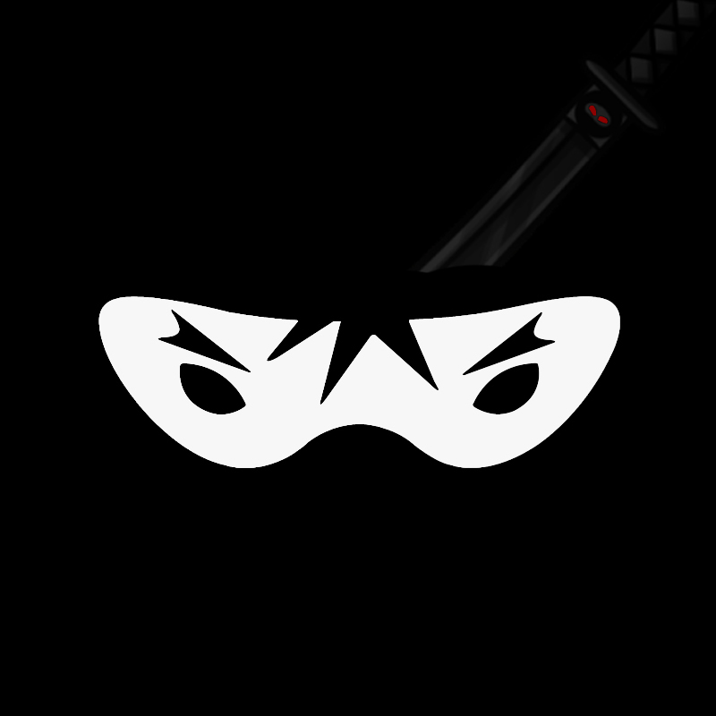

# New Game

Adds a new game to the BlindFold Games portal at `/Users/govandmurad/GDev/ClaudeCodeTest/`.

This command handles every file that needs to change: creating the game's portal page, updating the home page, and updating every existing game page. Follow the steps below exactly.

---

## Step 1 — Gather game info

If the user provided args (e.g. `/new-game Snake`), use the game name from args. Otherwise ask.

Collect the following, either from args or by asking the user:

| Field | Description |
|---|---|
| **Game name** | Display name, e.g. "Snake" |
| **Genre** | One of: Shooter / Puzzle / Strategy / Adventure / Racing / Other |
| **Emoji** | Single emoji to use as thumbnail icon, e.g. 🐍 |
| **Game source** | Path to an existing `.html` game file (must be iframe-ready — see requirements in Step 1c), OR the word `scratch` to generate a starter |
| **Thumbnail image** | Path to an image file (JPG/PNG) provided by the user — a screenshot or artwork of the game. This is required; do NOT generate or create an image yourself. |
| **Controls** | How the player controls the game (keys, mouse, etc.) |
| **How to play** | 1-2 sentences describing the objective and rules |

Then derive:
- **Slug**: lowercase game name, spaces → hyphens, strip non-alphanumeric. "Space Invaders" → `space-invaders`
- **Needs mobile controls**: `true` if Controls mentions keyboard keys or mouse movement/aiming; `false` if the game is click/tap only (browser already maps taps to clicks automatically)
- **Thumb class** (for `card-thumb` and `mini-thumb`):
  - Shooter → `space`
  - Puzzle → `teal`
  - Strategy → `dark1`
  - Adventure → `dark2`
  - Racing → `dark3`
  - Other → `dark4`
- **Tag class** (for `card-tag`):
  - Shooter → `shooter`
  - Puzzle → `puzzle`
  - All others → `strategy`
- **Genre label**: display string for the tag (use the genre exactly as given)

---

## Step 1c — Game iframe requirements

The game HTML file must fill the iframe completely with no scrollbars or whitespace. Before proceeding, verify (or ensure when building from scratch) that the game meets these requirements:

**Body must fill the viewport and hide overflow:**
```css
body { width: 100vw; height: 100vh; overflow: hidden; }
```

**All sizing must be responsive — no fixed pixel dimensions for layout:**
- **Canvas games:** scale the canvas using a resize function, e.g.:
  ```js
  function resize() {
    const scale = Math.min(innerWidth / 640, innerHeight / 360);
    canvas.style.width  = Math.floor(640 * scale) + 'px';
    canvas.style.height = Math.floor(360 * scale) + 'px';
  }
  window.addEventListener('resize', resize);
  resize();
  ```
- **DOM-based games (non-canvas):** use a **landscape** layout (content arranged horizontally — e.g. game board on one side, info panel on the other). Size everything with `clamp()`, `vmin`, `vw`, or `vh` so content scales with the frame. The board/main element should use something like `width: min(82vh, 46vw); aspect-ratio: 1;` rather than fixed pixel sizes.

If the user's provided game file does not meet these requirements, flag the issue and ask how they want to proceed before continuing.

---

## Step 1b — Handle thumbnail image

The user MUST provide an image (screenshot or artwork). Do NOT generate or create images yourself.

- Copy the user-provided image to `assets/games/[slug].png` (use `.jpg` if the source is a JPEG)
- macOS screenshot filenames often contain a Unicode narrow no-break space (U+202F) before AM/PM — use a glob pattern to copy them safely:
  ```bash
  cp "/path/to/Screenshot"*".png" "assets/games/[slug].png"
  ```
- If the user has not provided an image, ask them for one before proceeding. Do not continue without it.

---

## Step 2 — Discover existing games

Read every `games/*/index.html` file (excluding the new game's slug) to build a list of currently live games. For each, extract: slug, game name, emoji, thumb class, tag class, genre label.

This is needed so the new game page has a complete Other Games + Top Picks section, and so you know which existing pages to update in Step 5.

---

## Step 3 — Create the game's portal page

Create `games/[slug]/index.html` using the template below. Fill in all placeholders. The "Other Games" sidebar and "Top Picks" shelf must list ALL existing live games (discovered in Step 2) — not coming-soon cards.

```html
<!DOCTYPE html>
<html lang="en">
<head>
  <meta charset="UTF-8">
  <meta name="viewport" content="width=device-width, initial-scale=1.0">
  <title>[Game Name] — BlindFold Games</title>
  <meta name="description" content="Play [Game Name] free in your browser. No download, no login.">
  <link rel="canonical" href="https://mapwizard.gg/games/[slug]/">
  <meta property="og:title" content="[Game Name] — BlindFold Games">
  <meta property="og:description" content="Play [Game Name] free in your browser. No download, no login.">
  <meta property="og:type" content="website">
  <meta property="og:url" content="https://mapwizard.gg/games/[slug]/">
  <meta property="og:image" content="https://mapwizard.gg/assets/games/[slug].png">
  <meta property="og:site_name" content="BlindFold Games">
  <meta name="twitter:card" content="summary_large_image">
  <meta name="twitter:title" content="[Game Name] — BlindFold Games">
  <meta name="twitter:description" content="Play [Game Name] free in your browser. No download, no login.">
  <meta name="twitter:image" content="https://mapwizard.gg/assets/games/[slug].png">
  <script async src="https://www.googletagmanager.com/gtag/js?id=G-GFKCDCHWWB"></script>
  <script>window.dataLayer=window.dataLayer||[];function gtag(){dataLayer.push(arguments);}gtag('js',new Date());gtag('config','G-GFKCDCHWWB');</script>
  <script async src="https://pagead2.googlesyndication.com/pagead/js/adsbygoogle.js?client=ca-pub-4276539964985606" crossorigin="anonymous"></script>
  <link rel="stylesheet" href="../../css/style.css">
</head>
<body>

<div class="layout">

  <aside class="sidebar">
    <a href="../../index.html" class="sidebar-logo-wrap">
      
    </a>
    <nav class="sidebar-nav">
      <a href="../../index.html" class="sidebar-btn" data-tip="Home">
        <svg width="20" height="20" viewBox="0 0 24 24" fill="none" stroke="currentColor" stroke-width="2" stroke-linecap="round" stroke-linejoin="round">
          <path d="M3 9l9-7 9 7v11a2 2 0 0 1-2 2H5a2 2 0 0 1-2-2z"/>
          <polyline points="9 22 9 12 15 12 15 22"/>
        </svg>
      </a>
      <a href="../../index.html#all-games" class="sidebar-btn" data-tip="All Games">
        <svg width="20" height="20" viewBox="0 0 24 24" fill="none" stroke="currentColor" stroke-width="2" stroke-linecap="round" stroke-linejoin="round">
          <rect x="2" y="6" width="20" height="12" rx="2"/>
          <path d="M12 12h.01M8 12h.01M16 12h.01"/>
          <path d="M6 10v4M10 10v4"/>
        </svg>
      </a>
    </nav>
  </aside>

  <div class="main">

    <header class="top-header">
      <a href="../../index.html" class="site-name">BLIND<span>FOLD</span> GAMES</a>
      <div class="header-right">
        <a href="../../index.html" class="back-btn">← All Games</a>
      </div>
    </header>

    <div class="ad-banner">
      <div class="ad-slot leaderboard">Advertisement</div>
    </div>

    <div class="game-page-content">
      <div class="game-page-title">
        <span class="card-tag [tag-class]" style="font-size:0.68rem;padding:0.2rem 0.55rem">[Genre Label]</span>
        <h1>[Game Name]</h1>
      </div>

      <div class="game-layout">
        <div class="game-frame-wrap">
          <iframe src="[iframe-src]" title="[Game Name]" allowfullscreen tabindex="0"></iframe>
        </div>

        <div class="game-sidebar-ads">
          <div class="ad-slot rectangle">Advertisement</div>

          <div class="sidebar-section">
            <div class="shelf-header">
              <span class="shelf-icon">🎮</span>
              <h2>Other Games</h2>
            </div>
            <!-- One mini-card per existing live game (from Step 2) -->
            [MINI-CARDS FOR ALL EXISTING GAMES]
          </div>
        </div>
      </div>
    </div>

    <div class="ad-banner">
      <div class="ad-slot leaderboard">Advertisement</div>
    </div>

    <div class="about-game">
      <h2>About This Game</h2>
      <p>[About text — describe the game objective and setting in 1-2 sentences.]</p>
    </div>

    <div class="game-controls">
      <h2>Controls</h2>
      <div class="controls-list">
        <!-- One .control-item per input, e.g.: -->
        <!-- <div class="control-item"><kbd>W A S D</kbd> &nbsp;Move</div> -->
        <!-- <div class="control-item"><kbd>Left Click</kbd> &nbsp;Shoot</div> -->
        [CONTROLS LIST — one control-item per action, using <kbd> tags for keys]
      </div>
      <p>[How to play — 1-2 sentences on the rules and objective.]</p>
    </div>

    <div class="game-page-shelf">
      <div class="shelf-header">
        <span class="shelf-icon">🔥</span>
        <h2>Top Picks</h2>
      </div>
      <div class="games-grid">
        <!-- One game-card per existing live game (from Step 2) -->
        [GAME CARDS FOR ALL EXISTING GAMES]
      </div>
    </div>

    <footer>
      <div class="footer-links">
        <a href="../../index.html">Home</a>
        <a href="../../privacy-policy.html">Privacy Policy</a>
      </div>
      <span>© 2026 BlindFold Games</span>
    </footer>

  </div>
</div>

</body>
</html>
```

**iframe src rules:**
- If user provided an existing file path: use the relative path from `games/[slug]/` to that file
- If `scratch`: use `game.html` (will be created in Step 4)

**Mini-card pattern** (for sidebar Other Games, one per existing game):
```html
<a href="../[other-slug]/index.html" class="mini-card">
  <div class="mini-thumb"></div>
  <div class="mini-info">
    <div class="mini-title">[Other Game Name]</div>
    <span class="card-tag [other-tag-class]">[Other Genre]</span>
  </div>
</a>
```

**Top Picks card pattern** (for bottom shelf, one per existing game):
```html
<a href="../[other-slug]/index.html" class="game-card">
  <div class="card-thumb"></div>
  <div class="card-info">
    <div class="card-title">[Other Game Name]</div>
    <span class="card-tag [other-tag-class]">[Other Genre]</span>
  </div>
</a>
```

---

## Step 4 — Create game scaffold (only if user said "scratch")

Create `games/[slug]/game.html` — a minimal self-contained canvas game. This scaffold is iframe-ready and already includes the full mobile controls pattern (joystick + action button). Replace `[Game Name]` and `[ACTION-LABEL]` placeholders and add game logic where commented.

```html
<!DOCTYPE html>
<html lang="en">
<head>
  <meta charset="UTF-8">
  <meta name="viewport" content="width=device-width, initial-scale=1.0, user-scalable=no">
  <title>[Game Name]</title>
  <style>
    * { margin: 0; padding: 0; box-sizing: border-box; }
    body { background: #000; display: flex; align-items: center; justify-content: center; height: 100vh; overflow: hidden; }
    canvas { display: block; image-rendering: pixelated; }

    /* Mobile controls — hidden on desktop */
    #mc { display: none; }
    @media (pointer: coarse) {
      #mc { display: block; }
      canvas { touch-action: none; cursor: none; }
    }
    #mc-left, #mc-right { position: fixed; z-index: 50; touch-action: none; -webkit-tap-highlight-color: transparent; user-select: none; }
    #mc-joy-ring { position: fixed; width: 110px; height: 110px; border-radius: 50%; border: 2px solid rgba(255,255,255,0.3); background: rgba(255,255,255,0.05); pointer-events: none; z-index: 51; transform: translate(-50%,-50%); display: none; }
    #mc-joy-dot  { position: fixed; width: 46px; height: 46px; border-radius: 50%; background: rgba(255,255,255,0.4); border: 2px solid rgba(255,255,255,0.85); pointer-events: none; z-index: 52; transform: translate(-50%,-50%); display: none; }
    #mc-fire-btn { position: fixed; width: 84px; height: 84px; border-radius: 50%; background: rgba(249,115,22,0.3); border: 3px solid rgba(249,115,22,0.7); color: rgba(255,255,255,0.9); font-family: sans-serif; font-size: 0.65rem; font-weight: 700; letter-spacing: 0.12em; display: none; align-items: center; justify-content: center; pointer-events: none; z-index: 51; transition: background 0.08s; }
    #mc-fire-btn.active { background: rgba(249,115,22,0.65); border-color: rgba(249,115,22,1); }
  </style>
</head>
<body>
<canvas id="canvas"></canvas>

<div id="mc">
  <div id="mc-left"></div>
  <div id="mc-right"></div>
  <div id="mc-joy-ring"></div>
  <div id="mc-joy-dot"></div>
  <div id="mc-fire-btn">[ACTION-LABEL]</div>
</div>

<script>
  const canvas = document.getElementById('canvas');
  const ctx = canvas.getContext('2d');

  function resize() {
    const scale = Math.min(window.innerWidth / 640, window.innerHeight / 360);
    canvas.width = 640;
    canvas.height = 360;
    canvas.style.width  = Math.floor(640 * scale) + 'px';
    canvas.style.height = Math.floor(360 * scale) + 'px';
  }
  window.addEventListener('resize', resize);
  resize();

  // ── Game state ────────────────────────────────────────
  // Phase: 'start' | 'playing' | 'gameover'
  let phase = 'start', startPulse = 0;
  // Add your other game variables here

  function initGame(skipStart = false) {
    // Reset your game state here
    phase = skipStart ? 'playing' : 'start';
    startPulse = 0;
  }

  // ── Input ─────────────────────────────────────────────
  const keys = {};
  const mouse = { x: 320, y: 180, down: false, justPressed: false };

  window.addEventListener('keydown', e => {
    if (phase === 'start') { phase = 'playing'; return; }
    keys[e.key] = true;
  });
  window.addEventListener('keyup', e => keys[e.key] = false);
  canvas.addEventListener('mousemove', e => {
    const r = canvas.getBoundingClientRect();
    mouse.x = (e.clientX - r.left) * (640 / r.width);
    mouse.y = (e.clientY - r.top)  * (360 / r.height);
  });
  canvas.addEventListener('mousedown', () => {
    if (phase === 'start') { phase = 'playing'; return; }
    if (phase === 'gameover') { initGame(true); return; }
    mouse.down = true; mouse.justPressed = true;
  });
  canvas.addEventListener('mouseup', () => { mouse.down = false; });

  // ── Mobile controls ───────────────────────────────────
  window.addEventListener('load', function() {
    if (!window.matchMedia('(pointer: coarse)').matches) return;
    const mcLeft    = document.getElementById('mc-left');
    const mcRight   = document.getElementById('mc-right');
    const joyRing   = document.getElementById('mc-joy-ring');
    const joyDot    = document.getElementById('mc-joy-dot');
    const fireBtnEl = document.getElementById('mc-fire-btn');
    const JOY_RADIUS = 48;
    let joyId = null, joyX = 0, joyY = 0, fireId = null;

    function layout() {
      const r = canvas.getBoundingClientRect();
      const half = r.width / 2, m = Math.min(r.width * 0.045, 22), fb = 84;
      mcLeft.style.cssText  = `left:${r.left}px;top:${r.top}px;width:${half}px;height:${r.height}px;`;
      mcRight.style.cssText = `left:${r.left + half}px;top:${r.top}px;width:${half}px;height:${r.height}px;`;
      fireBtnEl.style.display = 'flex';
      fireBtnEl.style.left = (r.right  - fb - m) + 'px';
      fireBtnEl.style.top  = (r.bottom - fb - m) + 'px';
    }
    layout();
    window.addEventListener('resize', layout);

    function setMove(nx, ny, mag) {
      const t = 0.28;
      keys['ArrowUp']    = mag > 10 && ny < -t;
      keys['ArrowDown']  = mag > 10 && ny >  t;
      keys['ArrowLeft']  = mag > 10 && nx < -t;
      keys['ArrowRight'] = mag > 10 && nx >  t;
    }
    function clearMove() { ['ArrowUp','ArrowDown','ArrowLeft','ArrowRight'].forEach(k => keys[k] = false); }

    mcLeft.addEventListener('touchstart', e => {
      e.preventDefault();
      if (phase === 'start') { phase = 'playing'; return; }
      if (phase === 'gameover') { initGame(true); return; }
      for (const t of e.changedTouches) {
        if (joyId !== null) continue;
        joyId = t.identifier; joyX = t.clientX; joyY = t.clientY;
        joyRing.style.left = t.clientX + 'px'; joyRing.style.top = t.clientY + 'px';
        joyDot.style.left  = t.clientX + 'px'; joyDot.style.top  = t.clientY + 'px';
        joyRing.style.display = 'block'; joyDot.style.display = 'block';
      }
    }, { passive: false });

    mcLeft.addEventListener('touchmove', e => {
      e.preventDefault();
      for (const t of e.changedTouches) {
        if (t.identifier !== joyId) continue;
        const dx = t.clientX - joyX, dy = t.clientY - joyY, mag = Math.hypot(dx, dy);
        const nx = mag > 0 ? dx / mag : 0, ny = mag > 0 ? dy / mag : 0;
        const cap = Math.min(mag, JOY_RADIUS);
        joyDot.style.left = (joyX + nx * cap) + 'px'; joyDot.style.top = (joyY + ny * cap) + 'px';
        setMove(nx, ny, mag);
      }
    }, { passive: false });

    function onLeftEnd(e) {
      for (const t of e.changedTouches) {
        if (t.identifier !== joyId) continue;
        joyId = null; joyRing.style.display = 'none'; joyDot.style.display = 'none'; clearMove();
      }
    }
    mcLeft.addEventListener('touchend',    onLeftEnd, { passive: false });
    mcLeft.addEventListener('touchcancel', onLeftEnd, { passive: false });

    mcRight.addEventListener('touchstart', e => {
      e.preventDefault();
      if (phase === 'start') { phase = 'playing'; return; }
      if (phase === 'gameover') { initGame(true); return; }
      for (const t of e.changedTouches) {
        if (fireId !== null) continue;
        fireId = t.identifier; mouse.down = true; mouse.justPressed = true;
        fireBtnEl.classList.add('active');
      }
    }, { passive: false });

    function onFireEnd(e) {
      for (const t of e.changedTouches) {
        if (t.identifier !== fireId) continue;
        fireId = null; mouse.down = false; fireBtnEl.classList.remove('active');
      }
    }
    mcRight.addEventListener('touchend',    onFireEnd, { passive: false });
    mcRight.addEventListener('touchcancel', onFireEnd, { passive: false });

    // Optional auto-aim for shooter games — point mouse at nearest enemy each frame.
    // Uncomment and adapt if your game has an enemies array and a player object:
    //
    // ;(function aimLoop() {
    //   if (player && enemies && enemies.length > 0) {
    //     let nearest = enemies[0], minD = Infinity;
    //     for (const e of enemies) { const d = Math.hypot(e.x-player.x, e.y-player.y); if (d < minD) { minD=d; nearest=e; } }
    //     mouse.x = nearest.x; mouse.y = nearest.y;
    //   }
    //   requestAnimationFrame(aimLoop);
    // })();
  });

  // ── Update ────────────────────────────────────────────
  function update() {
    // Add your game logic here
    mouse.justPressed = false;
  }

  // ── Start screen ──────────────────────────────────────
  function renderStartScreen() {
    ctx.fillStyle = '#0a0a0a';
    ctx.fillRect(0, 0, 640, 360);
    ctx.textAlign = 'center'; ctx.textBaseline = 'middle';
    // Title
    ctx.font = 'bold 68px monospace';
    ctx.fillStyle = '#F97316';
    ctx.shadowColor = '#F97316'; ctx.shadowBlur = 14;
    ctx.fillText('[Game Name]', 320, 110);
    ctx.shadowBlur = 0; ctx.shadowColor = 'transparent';
    // How-to-play lines — replace with game-specific text
    ctx.font = '15px monospace';
    ctx.fillStyle = 'rgba(255,255,255,0.65)';
    ctx.fillText('[How-to-play line 1]', 320, 210);
    ctx.fillText('[How-to-play line 2]', 320, 234);
    // Controls hint
    ctx.font = '13px monospace';
    ctx.fillStyle = 'rgba(255,255,255,0.35)';
    ctx.fillText('[Controls hint, e.g. WASD to move · Mouse to aim · Click to fire]', 320, 270);
    // Pulsing start prompt
    const alpha = 0.45 + 0.55 * Math.sin(startPulse);
    ctx.font = 'bold 14px monospace';
    ctx.fillStyle = `rgba(249,115,22,${alpha.toFixed(2)})`;
    ctx.fillText('CLICK  ·  TAP  ·  PRESS ANY KEY TO START', 320, 326);
  }

  // ── Render ────────────────────────────────────────────
  function render() {
    ctx.fillStyle = '#0a0a0a';
    ctx.fillRect(0, 0, 640, 360);
    // Add your drawing code here
  }

  // ── Game loop ─────────────────────────────────────────
  function loop() {
    if (phase === 'start') {
      startPulse += 0.08;
      renderStartScreen();
    } else {
      update();
      render();
    }
    requestAnimationFrame(loop);
  }

  loop();
</script>
</body>
</html>
```

---

## Step 4b — Add mobile controls to existing game file (skip if scratch or not needed)

Skip this step if:
- The game source was `scratch` (scaffold already includes controls), OR
- **Needs mobile controls** is `false` (click-only game — taps map to clicks automatically)

Otherwise, open the provided game HTML file and make the following three additions:

**1 — Viewport meta:** add `user-scalable=no` if not already present:
```html
<meta name="viewport" content="width=device-width, initial-scale=1.0, user-scalable=no">
```

**2 — CSS:** add inside `<style>` (or a new `<style>` block in `<head>`):
```css
#mc { display: none; }
@media (pointer: coarse) {
  #mc { display: block; }
  canvas { touch-action: none; cursor: none; }
}
#mc-left, #mc-right { position: fixed; z-index: 50; touch-action: none; -webkit-tap-highlight-color: transparent; user-select: none; }
#mc-joy-ring { position: fixed; width: 110px; height: 110px; border-radius: 50%; border: 2px solid rgba(255,255,255,0.3); background: rgba(255,255,255,0.05); pointer-events: none; z-index: 51; transform: translate(-50%,-50%); display: none; }
#mc-joy-dot  { position: fixed; width: 46px; height: 46px; border-radius: 50%; background: rgba(255,255,255,0.4); border: 2px solid rgba(255,255,255,0.85); pointer-events: none; z-index: 52; transform: translate(-50%,-50%); display: none; }
#mc-fire-btn { position: fixed; width: 84px; height: 84px; border-radius: 50%; background: rgba(249,115,22,0.3); border: 3px solid rgba(249,115,22,0.7); color: rgba(255,255,255,0.9); font-family: sans-serif; font-size: 0.65rem; font-weight: 700; letter-spacing: 0.12em; display: none; align-items: center; justify-content: center; pointer-events: none; z-index: 51; transition: background 0.08s; }
#mc-fire-btn.active { background: rgba(249,115,22,0.65); border-color: rgba(249,115,22,1); }
```

**3 — HTML:** add immediately after the game's `<canvas>` element (or the main game container):
```html
<div id="mc">
  <div id="mc-left"></div>
  <div id="mc-right"></div>
  <div id="mc-joy-ring"></div>
  <div id="mc-joy-dot"></div>
  <div id="mc-fire-btn">[ACTION-LABEL]</div>
</div>
```
Replace `[ACTION-LABEL]` with a short label matching the game's action (e.g. `FIRE`, `JUMP`, `ACT`).

**4 — JS:** add at the end of `<body>` (after all existing scripts), adapting the variable names to match the game's input model:
```html
<script>
window.addEventListener('load', function() {
  if (!window.matchMedia('(pointer: coarse)').matches) return;
  const mcLeft    = document.getElementById('mc-left');
  const mcRight   = document.getElementById('mc-right');
  const joyRing   = document.getElementById('mc-joy-ring');
  const joyDot    = document.getElementById('mc-joy-dot');
  const fireBtnEl = document.getElementById('mc-fire-btn');
  // ↑ Use the game's canvas element reference for layout()
  const gameCanvas = document.getElementById('[CANVAS-ID]');
  const JOY_RADIUS = 48;
  let joyId = null, joyX = 0, joyY = 0, fireId = null;

  function layout() {
    const r = gameCanvas.getBoundingClientRect();
    const half = r.width / 2, m = Math.min(r.width * 0.045, 22), fb = 84;
    mcLeft.style.cssText  = `left:${r.left}px;top:${r.top}px;width:${half}px;height:${r.height}px;`;
    mcRight.style.cssText = `left:${r.left + half}px;top:${r.top}px;width:${half}px;height:${r.height}px;`;
    fireBtnEl.style.display = 'flex';
    fireBtnEl.style.left = (r.right  - fb - m) + 'px';
    fireBtnEl.style.top  = (r.bottom - fb - m) + 'px';
  }
  layout();
  window.addEventListener('resize', layout);

  // Adapt these key names to whatever the game uses for movement
  function setMove(nx, ny, mag) {
    const t = 0.28;
    keys['ArrowUp']    = mag > 10 && ny < -t;  // or keys['w'], etc.
    keys['ArrowDown']  = mag > 10 && ny >  t;
    keys['ArrowLeft']  = mag > 10 && nx < -t;
    keys['ArrowRight'] = mag > 10 && nx >  t;
  }
  function clearMove() { ['ArrowUp','ArrowDown','ArrowLeft','ArrowRight'].forEach(k => keys[k] = false); }

  mcLeft.addEventListener('touchstart', e => {
    e.preventDefault();
    for (const t of e.changedTouches) {
      if (joyId !== null) continue;
      joyId = t.identifier; joyX = t.clientX; joyY = t.clientY;
      joyRing.style.left = t.clientX+'px'; joyRing.style.top = t.clientY+'px';
      joyDot.style.left  = t.clientX+'px'; joyDot.style.top  = t.clientY+'px';
      joyRing.style.display = 'block'; joyDot.style.display = 'block';
    }
  }, { passive: false });

  mcLeft.addEventListener('touchmove', e => {
    e.preventDefault();
    for (const t of e.changedTouches) {
      if (t.identifier !== joyId) continue;
      const dx = t.clientX-joyX, dy = t.clientY-joyY, mag = Math.hypot(dx,dy);
      const nx = mag > 0 ? dx/mag : 0, ny = mag > 0 ? dy/mag : 0;
      const cap = Math.min(mag, JOY_RADIUS);
      joyDot.style.left = (joyX+nx*cap)+'px'; joyDot.style.top = (joyY+ny*cap)+'px';
      setMove(nx, ny, mag);
    }
  }, { passive: false });

  function onLeftEnd(e) {
    for (const t of e.changedTouches) {
      if (t.identifier !== joyId) continue;
      joyId = null; joyRing.style.display='none'; joyDot.style.display='none'; clearMove();
    }
  }
  mcLeft.addEventListener('touchend',    onLeftEnd, { passive: false });
  mcLeft.addEventListener('touchcancel', onLeftEnd, { passive: false });

  mcRight.addEventListener('touchstart', e => {
    e.preventDefault();
    for (const t of e.changedTouches) {
      if (fireId !== null) continue;
      fireId = t.identifier;
      // Adapt: set whatever the game uses for "action pressed"
      mouse.down = true; mouse.justPressed = true;
      fireBtnEl.classList.add('active');
    }
  }, { passive: false });

  function onFireEnd(e) {
    for (const t of e.changedTouches) {
      if (t.identifier !== fireId) continue;
      fireId = null;
      mouse.down = false;  // adapt to game's action variable
      fireBtnEl.classList.remove('active');
    }
  }
  mcRight.addEventListener('touchend',    onFireEnd, { passive: false });
  mcRight.addEventListener('touchcancel', onFireEnd, { passive: false });

  // Auto-aim for shooter games: uncomment and adapt if game has enemies array + player object
  // ;(function aimLoop() {
  //   if (player && enemies && enemies.length > 0) {
  //     let nearest = enemies[0], minD = Infinity;
  //     for (const e of enemies) { const d = Math.hypot(e.x-player.x, e.y-player.y); if (d < minD) { minD=d; nearest=e; } }
  //     mouse.x = nearest.x; mouse.y = nearest.y;
  //   }
  //   requestAnimationFrame(aimLoop);
  // })();
});
</script>
```

**Adaptation checklist:**
- `[CANVAS-ID]` → the game's actual canvas element id
- `keys['ArrowUp']` etc. → whatever key names the game uses for movement
- `mouse.down` / `mouse.justPressed` → whatever the game uses to track the action button state
- Uncomment and adapt the auto-aim loop for top-down shooters where the player faces enemies

---

## Step 5 — Update `index.html`

Read `index.html`. Make two edits:

**Edit A — Hero section small-card grid:**
Find the FIRST `<div class="game-card coming-soon">` inside the `.small-card-grid` div. Replace the entire element (from `<div class="game-card coming-soon">` to its closing `</div>`) with a real `<a>` card:
```html
<a href="games/[slug]/index.html" class="game-card">
  <div class="card-thumb">
    
  </div>
  <div class="card-info">
    <div class="card-title">[Game Name]</div>
    <span class="card-tag [tag-class]">[Genre Label]</span>
  </div>
</a>
```

**Edit B — All Games grid:**
Find the FIRST `<div class="game-card coming-soon">` inside the `.games-grid` div. Replace it with the same real `<a>` card pattern above.

---

## Step 6 — Update every existing game page

For each existing game page discovered in Step 2 (loop over all `games/*/index.html` except the new game):

**Edit A — Other Games sidebar:**
Find the comment `<!-- Other Games -->` section. Insert a new `<a class="mini-card">` for the new game immediately BEFORE the first `<div class="mini-card coming-soon">` in that sidebar section.

```html
<a href="../[slug]/index.html" class="mini-card">
  <div class="mini-thumb"></div>
  <div class="mini-info">
    <div class="mini-title">[Game Name]</div>
    <span class="card-tag [tag-class]">[Genre Label]</span>
  </div>
</a>
```

**Edit B — Top Picks shelf:**
Find the `.game-page-shelf` div (the Top Picks section at the bottom). Insert a new `<a class="game-card">` for the new game immediately BEFORE the first `<div class="game-card coming-soon">` in that shelf's `.games-grid`.

```html
<a href="../[slug]/index.html" class="game-card">
  <div class="card-thumb"></div>
  <div class="card-info">
    <div class="card-title">[Game Name]</div>
    <span class="card-tag [tag-class]">[Genre Label]</span>
  </div>
</a>
```

---

## Step 7 — Update sitemap.xml

Add a new `<url>` entry to `sitemap.xml` for the new game:

```xml
  <url>
    <loc>https://mapwizard.gg/games/[slug]/</loc>
    <changefreq>monthly</changefreq>
    <priority>0.8</priority>
    <lastmod>[today's date as YYYY-MM-DD]</lastmod>
  </url>
```

---

## Step 8 — Commit and push

Stage all new and modified files, then commit and push:

```bash
git add games/[slug]/ assets/games/[slug].png index.html games/*/index.html sitemap.xml
git commit -m "feat: add [Game Name] to BlindFold Games portal"
git push
```

---

## Step 9 — Report completion

Tell the user:
- What files were created
- What files were updated
- The local URL to test: `http://localhost:8080/games/[slug]/`
- If scaffold was created, remind them to replace the placeholder game code in `games/[slug]/game.html`
